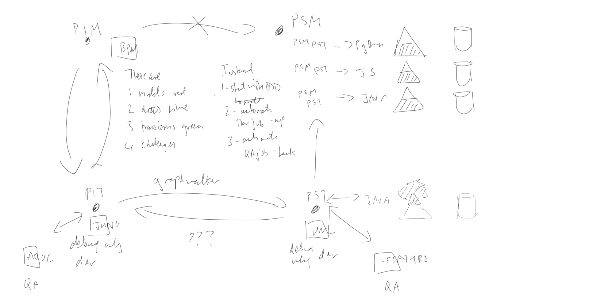

# Project Structure

# MDD as I was taught

I was taught Model Driven Development in the context of a Waterfall methodology.
[This](https://www.researchgate.net/publication/237697446_Model_Transformers_for_Test_Generation_from_System_Models) document from ResearchGate has a [diagram](https://www.researchgate.net/figure/Derivation-of-test-models_fig9_237697446) that I often refer to.
I'm not sure if I'm allowed to upload a copy here so I'm just linking to it for now; I'll sketch a simpler version of the diagram and upload it here in the future.
The diagram shows transformations between 6 sets of files. I put a simple description of what they are.

| Set | Description |
| --- | ------------|
| PIM | Requirements, I'll capture these in some [BPM with Camunda](https://camunda.com/platform/modeler/) |
| PSM | System code design, I'll use the [EMF UML API](https://download.eclipse.org/modeling/mdt/uml2/javadoc/5.5.0/)  |
| System Code | The actual code deployed to production. I'll use [JHipster](https://www.jhipster.tech/) to generate some of the code from the UML model. I'll also transform the UML model into Python because I want more experience with it |
| PIT | Test data selection criteria. These aren't the test cases. They're data selection rules used to create test data. I'm using [GraphWalker](https://graphwalker.github.io/) for this. I've previously used [Test Modeller](https://www.curiositysoftware.ie/test-modeller) before but Graphwalker is free. |
| PST | Test code design. Same as the PSM, I'll use EMF and UML |
| Test Code | The test cases and test automation code. I'll use Cucumber and Java for that since it's what I'm most familiar with. |

# The Agile testing pyramid and test automation

When I managed a QA team, I coached everyone on my team, about 30+ folks to use Cucumber, Eclipse, Git etc. 
There were separate dev repos for all the individual systems but just one QA repo.
The manual testers never automated anything before so they never put anything in Git.
The question then was where should the feature files or test code go? 
Does it go into the dev repos or a new QA one?
What I suggested is that the feature files and E2E test automation code goes in the QA repo.
The integration, component, unit test automation code would go in dev repos. 
I'll demo it later but basically
1. You'd clone two Git repos into the one workspace
2. Checkout both branches
3. Generate the model from the Test Code
4. Then transform that into whatever test framework and language at whichever layer in the pyramind you want in the dev repo. 

If you know what dependency injection is and have read the Cucumber for Java book then you'll understand what I mean by transforming the feature file data into a unit test or an integration test in 4 above. If not, I'll demo that here. 
Also the book uses Java for both layers but what if you had multiple programming languages, that's why the model is used as an intermediary.

# MDD as I practiced it

I've modified the diagram to take into account the testing pyramid or testing throughout the process instead of just at the end. In this view the PST has the top half of the testing pyramid test automation code. The PSM would have the bottom half for each component.

